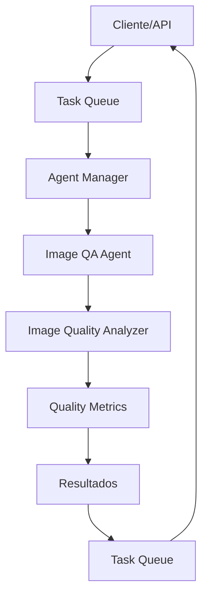

# Guía de Integración con Sistema de Colas

## Introducción

El Agente 1: Analista de Calidad de Imágenes está diseñado para integrarse perfectamente con el sistema de orquestación de agentes existente. Esta guía explica cómo configurar y utilizar esta integración.

## Arquitectura de Integración

### Componentes del Sistema de Orquestación

1. **Agent Manager**: Gestiona el ciclo de vida de los agentes
2. **Task Queue**: Sistema de colas de trabajo
3. **LangGraph Coordinator**: Coordinador de workflows
4. **Image QA Agent**: Agente especializado en análisis de imágenes

### Flujo de Integración



## Configuración de Integración

### 1. Inicialización del Agente

```python
from src.queue_integration import create_queue_integrated_agent
from config import AgentConfig

# Crear configuración
config = AgentConfig(
    agent_id="agent_1_qa_imagenes_001",
    agent_type="qa_specialist",
    enable_queue_integration=True,
    max_concurrent_analyses=5
)

# Crear agente integrado
agent = create_queue_integrated_agent(config)
```

### 2. Registro con Agent Manager

```python
# El agente se auto-registra con el Agent Manager
agent_id = await agent_manager.create_agent(
    agent_type="qa_specialist",
    agent_id="image_qa_001",
    custom_config={
        "capabilities": ["image_quality_analysis", "batch_processing"],
        "skills": ["computer_vision", "image_processing", "quality_assessment"],
        "max_concurrent_tasks": 5
    }
)
```

### 3. Configuración de Task Queue

```python
# Enviar tareas al sistema de colas
task_id = await task_queue.submit_agent_task(
    agent_id="image_qa_001",
    task_data={
        "task_type": "analyze_image",
        "image_source": {
            "path": "/path/to/image.jpg"
        },
        "analysis_options": {
            "include_detailed_metrics": True,
            "include_recommendations": True
        }
    },
    priority=TaskPriority.NORMAL
)
```

## Tipos de Tareas Soportadas

### 1. Análisis Individual de Imagen

```json
{
    "task_type": "analyze_image",
    "image_source": {
        "path": "/ruta/a/imagen.jpg"
    },
    "analysis_options": {
        "include_detailed_metrics": true,
        "include_histogram": true,
        "include_recommendations": true
    }
}
```

**Respuesta:**
```json
{
    "success": true,
    "result": {
        "image_path": "/ruta/a/imagen.jpg",
        "overall_score": 78.5,
        "overall_level": "good",
        "metrics": {
            "brisque": {
                "score": 25.3,
                "level": "good"
            },
            "sharpness": {
                "score": 82.1,
                "level": "excellent"
            }
        },
        "issues": [],
        "recommendations": [
            "Excelente calidad general detectada"
        ]
    },
    "processing_time": 0.45,
    "timestamp": "2025-11-06T15:57:06"
}
```

### 2. Análisis por Lotes

```json
{
    "task_type": "analyze_batch",
    "image_sources": [
        {"path": "/ruta/img1.jpg"},
        {"path": "/ruta/img2.jpg"},
        {"path": "/ruta/img3.jpg"}
    ],
    "analysis_options": {
        "include_detailed_metrics": false
    }
}
```

**Respuesta:**
```json
{
    "success": true,
    "total_images": 3,
    "successful_analyses": 3,
    "failed_analyses": 0,
    "results": [/* resultados individuales */]
}
```

### 3. Reporte de Calidad Detallado

```json
{
    "task_type": "get_quality_report",
    "image_path": "/ruta/a/imagen.jpg",
    "include_recommendations": true,
    "include_detailed_metrics": true
}
```

### 4. Calibración de Umbrales

```json
{
    "task_type": "calibrate_thresholds",
    "reference_images": [
        "/ruta/ref1.jpg",
        "/ruta/ref2.jpg",
        "/ruta/ref3.jpg"
    ],
    "quality_profiles": {
        "ecommerce": {
            "min_score": 70
        }
    }
}
```

### 5. Verificación Masiva

```json
{
    "task_type": "bulk_quality_check",
    "image_directory": "/ruta/a/catalogo",
    "quality_threshold": 70.0,
    "recursive_search": true,
    "output_report_path": "/ruta/reporte_calidad.json"
}
```

## Configuración en el Sistema Principal

### 1. Actualizar Agent Manager

Agregar el nuevo tipo de agente en `agent_manager.py`:

```python
# En _load_agent_templates()
self.agent_templates.update({
    "qa_specialist": {
        "name": "Especialista en Calidad de Imágenes",
        "agent_type": AgentType.CUSTOM,
        "model": "llama3.1:8b",  # Opcional para casos que requieran LLM
        "system_prompt": "Eres un especialista en análisis de calidad de imágenes usando OpenCV.",
        "skills": ["computer_vision", "image_processing", "quality_assessment"],
        "capabilities": ["image_quality_analysis", "batch_processing", "quality_reporting"],
        "max_concurrent_tasks": 5
    }
})
```

### 2. Actualizar Task Queue

En `task_queue.py`, agregar los nuevos tipos de tareas:

```python
# En _execute_task_by_type()
elif task.task_type == "IMAGE_QA_TASK":
    return await self._execute_image_qa_task(task)
```

```python
async def _execute_image_qa_task(self, task: Task) -> Dict:
    """Ejecuta tarea de análisis de calidad de imagen"""
    try:
        from src.queue_integration import handle_queue_task
        result = await handle_queue_task(task.payload)
        return result
    except Exception as e:
        logger.error(f"Error ejecutando tarea QA: {e}")
        raise
```

### 3. Workflow Ejemplo

```python
async def create_image_quality_workflow():
    """Crea un workflow para análisis de calidad"""
    
    # 1. Crear tarea de análisis individual
    individual_task_id = await task_queue.submit_agent_task(
        agent_id="image_qa_001",
        task_data={
            "task_type": "analyze_image",
            "image_source": {"path": "/path/to/product_image.jpg"}
        },
        priority=TaskPriority.HIGH
    )
    
    # 2. Crear tarea de análisis por lotes
    batch_task_id = await task_queue.submit_agent_task(
        agent_id="image_qa_001",
        task_data={
            "task_type": "analyze_batch",
            "image_sources": [
                {"path": "/path/to/img1.jpg"},
                {"path": "/path/to/img2.jpg"}
            ]
        },
        priority=TaskPriority.NORMAL
    )
    
    # 3. Crear tarea de verificación masiva
    bulk_task_id = await task_queue.submit_agent_task(
        agent_id="image_qa_001",
        task_data={
            "task_type": "bulk_quality_check",
            "image_directory": "/path/to/catalog",
            "quality_threshold": 75.0,
            "output_report_path": "/path/to/quality_report.json"
        },
        priority=TaskPriority.LOW
    )
    
    return {
        "individual_task_id": individual_task_id,
        "batch_task_id": batch_task_id,
        "bulk_task_id": bulk_task_id
    }
```

## Monitoreo y Métricas

### 1. Métricas del Agente

```python
# Obtener estadísticas del agente
agent_stats = await agent.get_performance_stats()

print(f"Total de análisis: {agent_stats['total_analyses']}")
print(f"Tiempo promedio: {agent_stats['average_processing_time']:.2f}s")
print(f"Tamaño de cache: {agent_stats['cache_size']}")
```

### 2. Métricas del Sistema de Colas

```python
# Estado de la cola de tareas
queue_status = await task_queue.get_queue_status()

print(f"Tareas activas: {queue_status['active_tasks']}")
print(f"Profundidad de cola: {queue_status['queue_depth']}")
print(f"Workers activos: {queue_status['active_workers']}")
```

### 3. Monitoreo de Salud

```python
# Verificación de salud del agente integrado
health_check = await agent.analyzer.health_check()

print(f"Estado: {health_check['status']}")
print(f"ID: {health_check['agent_id']}")
print(f"Métricas disponibles: {health_check['metrics_available']}")
```

## Configuración de Producción

### 1. Configuración para Alta Concurrencia

```python
production_config = AgentConfig(
    agent_id="agent_1_qa_imagenes_prod",
    max_concurrent_analyses=10,
    max_image_size=100*1024*1024,  # 100MB
    analysis_timeout=60,  # 60 segundos
    api_debug=False,
    enable_performance_logging=True,
    cache_max_size=2000  # Cache más grande
)
```

### 2. Configuración para Desarrollo

```python
development_config = AgentConfig(
    agent_id="agent_1_qa_imagenes_dev",
    max_concurrent_analyses=2,
    api_debug=True,
    log_level="DEBUG",
    enable_performance_logging=True
)
```

### 3. Configuración para Testing

```python
testing_config = AgentConfig(
    agent_id="agent_1_qa_imagenes_test",
    max_concurrent_analyses=1,
    analysis_timeout=30,
    max_image_size=10*1024*1024,  # 10MB para tests
    enable_performance_logging=False
)
```

## Casos de Uso Avanzados

### 1. Pipeline de E-commerce

```python
async def ecommerce_image_pipeline():
    """Pipeline completo para validación de imágenes de productos"""
    
    # 1. Subir imagen
    upload_task_id = await task_queue.submit_task(
        task_type="FILE_UPLOAD",
        payload={"file_path": "/tmp/uploaded_image.jpg"}
    )
    
    # 2. Análisis de calidad
    quality_task_id = await task_queue.submit_agent_task(
        agent_id="image_qa_001",
        task_data={
            "task_type": "get_quality_report",
            "image_path": "/tmp/uploaded_image.jpg",
            "include_recommendations": True
        },
        dependencies=[upload_task_id]
    )
    
    # 3. Decidir acción basada en calidad
    def quality_callback(task_id, result):
        score = result['result']['report']['quality_summary']['overall_score']
        if score >= 80:
            # Aprobar y almacenar
            pass
        elif score >= 60:
            # Requiere revisión manual
            pass
        else:
            # Rechazar
            pass
    
    await task_queue.schedule_task(
        task_type="QUALITY_DECISION",
        payload={"quality_task_id": quality_task_id},
        run_at=datetime.now() + timedelta(seconds=5),
        callback=quality_callback
    )
```

### 2. Procesamiento de Catálogo

```python
async def catalog_processing_pipeline():
    """Pipeline para procesamiento de catálogos completos"""
    
    # 1. Análisis masivo inicial
    bulk_task_id = await task_queue.submit_agent_task(
        agent_id="image_qa_001",
        task_data={
            "task_type": "bulk_quality_check",
            "image_directory": "/data/catalog_images",
            "quality_threshold": 70.0,
            "recursive_search": True,
            "output_report_path": "/reports/catalog_quality.json"
        },
        priority=TaskPriority.LOW
    )
    
    # 2. Generar reporte resumen
    async def generate_summary_report():
        await asyncio.sleep(60)  # Esperar a que termine el bulk check
        
        # Leer reporte generado
        with open("/reports/catalog_quality.json") as f:
            report = json.load(f)
        
        # Generar resumen
        summary = {
            "total_images": report['summary']['total_images'],
            "approved_images": report['summary']['high_quality'],
            "needs_review": report['summary']['medium_quality'],
            "rejected_images": report['summary']['low_quality'],
            "average_quality": report['summary']['average_score']
        }
        
        print(f"Reporte de catálogo generado: {summary}")
    
    # Programar generación de resumen
    asyncio.create_task(generate_summary_report())
```

## Troubleshooting de Integración

### Problemas Comunes

1. **Agente no responde**
   - Verificar que esté registrado en Agent Manager
   - Revisar logs de conexión con Task Queue
   - Comprobar configuración de red

2. **Tareas se acumulan en cola**
   - Verificar capacidad de procesamiento
   - Aumentar número de workers
   - Revisar timeouts

3. **Performance degradada**
   - Monitorear uso de memoria
   - Ajustar configuración de concurrencia
   - Optimizar tamaño de cache

### Debugging

```python
# Habilitar logs detallados
import logging
logging.getLogger("queue_integration").setLevel(logging.DEBUG)

# Verificar registro del agente
agent_status = await agent.get_status()
print(f"Estado del agente: {agent_status}")

# Verificar tareas pendientes
queue_status = await task_queue.get_queue_status()
print(f"Estado de cola: {queue_status}")
```

Esta guía proporciona toda la información necesaria para integrar exitosamente el Agente 1: Analista de Calidad de Imágenes con el sistema de orquestación existente.